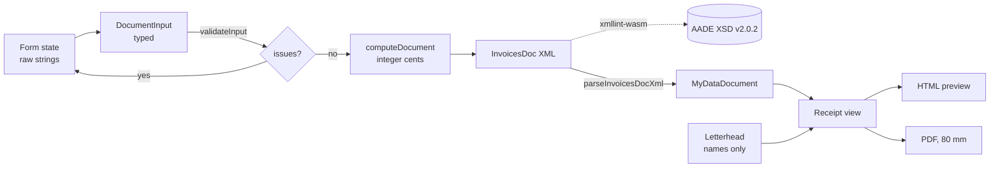

# myDATA XML → receipt (demo)


A typed TypeScript library that builds **AADE myDATA `InvoicesDoc` XML** (schema v2.0.2) for a
Greek retail receipt (**11.1 Απόδειξη Λιανικής Πώλησης**) and a sales invoice (**1.1 Τιμολόγιο
Πώλησης**), plus a one-page Next.js demo that turns that XML into a printable 80 mm receipt PDF.
The point is to show how I handle fiscal data: integer money, an explicit rounding rule, schema
order taken from the official XSD, validation against that XSD in tests and in the browser, and
a PDF rendered **from the XML** (parsed back into a typed object) rather than from form state, so
the XML is the single source of truth.

> **Demo only.** Nothing is transmitted to AADE or anywhere else, and the page makes no network
> calls beyond its own static files. The issuer ("Demo Shop", ΑΦΜ `000000000`) and the buyer are
> fictional, and every printout carries a watermark: _ΔΕΙΓΜΑ — ΜΗ ΕΓΚΥΡΟ ΦΟΡΟΛΟΓΙΚΟ ΣΤΟΙΧΕΙΟ /
> DEMO — NOT A VALID FISCAL DOCUMENT_.

## How it works



| Package                                        | What it is                                                                 |
| ---------------------------------------------- | -------------------------------------------------------------------------- |
| [`packages/mydata-xml`](./packages/mydata-xml) | Zero-UI library: types, VAT maths, XML builder, strict parser, XSD check   |
| [`apps/demo`](./apps/demo)                     | Static Next.js page: form, syntax-highlighted XML, receipt preview and PDF |

### Why the PDF also needs a "letterhead"

The XML deliberately does not contain everything a printout shows. Spec §5.1 note 3 says that
for a **Greek issuer, `name` and `address` are not accepted** in the XML, and for a **Greek
counterpart, `name` is not accepted** (its address is allowed, with `postalCode` and `city`
required). AADE already knows those from the ΑΦΜ. So the library has no name or address
fields for the issuer, the parser rejects XML that contains them, and the demo takes **display
names (and the issuer's address) from a fixed letterhead profile**, keyed by ΑΦΜ. Everything
else on the receipt (numbers, dates, lines, amounts, the buyer's address) comes from the parsed
XML.

For the same reason the receipt prints line totals but no unit price: `invoiceDetails` has no
unit-price field, and dividing a rounded total by the quantity does not give back the price that
was entered.

## Library usage

```ts
import { buildInvoicesDocXml, parseInvoicesDocXml } from '@pogasnik/mydata-xml';
import { validateInvoicesDocXml } from '@pogasnik/mydata-xml/validate';

const xml = buildInvoicesDocXml({
  documentType: '11.1',
  issuer: { vatNumber: '000000000', country: 'GR', branch: 0 },
  series: 'DEMO',
  aa: '1',
  issueDate: '2026-10-01',
  paymentMethod: 7, // 7 = POS / e-POS
  lines: [
    { name: 'Φέτα', quantity: 0.5, unitPriceCents: 1299, vatCategory: 2, measurementUnit: 2 },
  ],
});
const { valid } = await validateInvoicesDocXml(xml); // official AADE XSD, via WebAssembly
const doc = parseInvoicesDocXml(xml); // doc.totals → { netCents: 575, vatCents: 75, grossCents: 650 }
```

Invalid input throws `MyDataInputError` with every problem listed (`validateInput` returns the
same list without throwing, which is what the form uses). The parser throws `MyDataParseError`
with an element path, e.g. `invoice/invoiceDetails[2]/vatAmount`, if the XML is outside the
supported subset or is internally inconsistent (VAT not matching the rounding rule, totals not
equal to the sum of lines, payment not equal to the gross total).

## Money and rounding rule

- **Integer cents** throughout; quantities are integer thousandths (up to 3 decimals, e.g. 0.5 kg).
  Floating point is never used for money. Multiplications go through `BigInt`.
- **Half-up** rounding (0.005 → 0.01), **per line**, then **totals = sum of the rounded lines**.
  Totals are never re-rounded.
- **Retail receipt (11.1): prices include VAT.**
  `gross = round(qty × unit)`, `net = round(gross / (1 + rate))`, `vat = gross − net`.
  VAT is taken by difference, so net + VAT always equals the shelf price.
- **Sales invoice (1.1): prices are net.**
  `net = round(qty × unit)`, `vat = round(net × rate)`, `gross = net + vat`.

Worked examples (all covered by tests):

| Case                          | Calculation                                                            |
| ----------------------------- | ---------------------------------------------------------------------- |
| 0.5 kg × 2.99 € (VAT incl.)   | 1.495 → **1.50**                                                       |
| 2 × 2.40 € at 24% (VAT incl.) | gross 4.80, net 4.80 / 1.24 = 3.8709 → **3.87**, VAT **0.93**          |
| 2.50 € net at 13%             | VAT 0.325 → **0.33** (banker's rounding would give 0.32)               |
| 3 × 0.05 € at 13% (VAT incl.) | per line net 0.04 → document net **0.12**, not round(0.15/1.13) = 0.13 |

Supported codes (spec Appendix 8): VAT categories 1 = 24%, 2 = 13%, 3 = 6%, 7 = 0% (0% requires
`vatExemptionCategory` 1–31); payment methods 3 = cash, 7 = POS/e-POS, 5 = on credit (1.1 only);
units 1 = pieces, 2 = kg, 3 = litres. Income classification is `category1_1` with `E3_561_003`
(11.1, retail) or `E3_561_001` (1.1, wholesale).

## Run it

Requires Node 22.12+ (see `.nvmrc`) and pnpm 10.

```sh
pnpm install
pnpm dev              # builds the library, then starts the demo on http://localhost:3000
pnpm -r build         # library → packages/mydata-xml/dist, demo → apps/demo/out (static)
pnpm -r test          # Vitest, with coverage for the library
pnpm lint && pnpm typecheck && pnpm format:check
```

What the tests cover:

- **VAT maths**: half-up at exactly 0.005, fractional quantities, 0%, zero and one-cent lines,
  mixed rates, per-line rounding versus total-level rounding, 2^53 overflow safety.
- **XSD validation** (official v2.0.2 files with xmllint-wasm): valid 11.1 and 1.1 documents,
  15 random documents, and documents that must fail (element order, 3-decimal and negative
  amounts, out-of-range codes, missing or unknown elements, wrong namespace).
- **Round trip**: `parse(build(x))` equals the computed document for both types and for 500
  seeded random inputs, including names that need XML escaping.
- **Parser rejections**: 40 tampered documents, each asserting the exact error path.
- **Demo**: the letterhead/XML split, gross vs net printing, the PDF embedding the Greek font on a
  single page, form parsing (`2,40` and `2.40`).

The XSD files are vendored byte-for-byte in [`packages/mydata-xml/xsd/`](./packages/mydata-xml/xsd)
with their source, version and checksums.

## Scope and limits

- **No transmission**, no credentials, no API keys, no provider code. The library builds,
  validates and parses XML; that is all.
- **Two document types**: 11.1 and 1.1. No credit notes, returns, discounts, withholding taxes,
  fees, stamp duty, delivery notes, multiple payment methods or series numbering. The code is
  organised so that another type is mostly a new entry in `DOCUMENT_TYPES`.
- **Greek parties only** (`country: 'GR'`), EUR only, one `invoice` per `InvoicesDoc`.
- **MARK, UID and QR code** are assigned by AADE on transmission, so the receipt prints `—` and
  an empty dashed "QR" box.
- **`itemDescr` is a deliberate deviation.** The XSD accepts it on any line, but the spec's
  field table (§5.4) says it is accepted only for tax-free documents, invoice/delivery notes and
  delivery notes. The demo includes it so line names survive the XML round trip; a real 11.1 /
  1.1 submission would build with `{ includeItemDescr: false }` and keep names in its own data.
- The `E3_561_003` / `E3_561_001` pairing with 11.1 / 1.1 comes from AADE's classification
  combinations table, not from the XSD, and is the part most worth re-checking against the
  current table before reusing this anywhere real.

## Deploying the demo

`apps/demo` is a static export (`output: 'export'`). On Vercel, create a project with **Root
Directory `apps/demo`**; [`apps/demo/vercel.json`](./apps/demo/vercel.json) builds the library first
(`pnpm --filter @pogasnik/mydata-demo... build`) and serves `out/`.

## Author and licence

Nikolaos Pogas · [github.com/pogasnik](https://github.com/pogasnik) · Portfolio: <!-- TODO: portfolio URL -->

Copyright © 2026 Nikolaos Pogas. **All rights reserved.** The source is published for viewing
as a portfolio sample only; no permission is granted to use, copy, modify or distribute it. See
[LICENSE](./LICENSE). Noto Sans is © The Noto Project Authors, under the SIL Open Font License
([`apps/demo/public/fonts/OFL.txt`](./apps/demo/public/fonts/OFL.txt)). Not affiliated with AADE.
